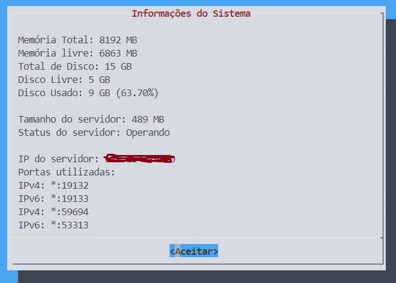

# MineServerTools

O **MineServerTools** é um conjunto de ferramentas essenciais para manter um servidor Minecraft sempre ativo em um servidor Linux. Ele oferece recursos que facilitam a administração e a otimização do seu servidor. Aqui estão alguns dos benefícios e funcionalidades principais:

1. **Monitoramento e Reinicialização Automática**: O **MineServerTools** verifica regularmente o status do servidor Minecraft e reinicia automaticamente o servidor caso ele pare de responder. Isso ajuda a manter o servidor online e minimiza o tempo de inatividade.

2. **Backup Automático**: O projeto inclui um sistema de backup automático que cria cópias de segurança regulares dos arquivos do servidor. Isso é crucial para proteger seus dados e evitar perda de progresso.

3. **Agendamento de Tarefas**: Com o **MineServerTools**, você pode agendar tarefas específicas, como reinicializações programadas, backups ou outras ações. Isso permite uma gestão mais eficiente do servidor.

---

# Instalação do pacote no Debian/Ubuntu

- Para instalar este pacote Deb, você pode usar o comando abaixo como no exemplo:

  ```bash
  sudo dpkg -i MineServerTools_1.1.1_all.deb
  ```

# Desinstalação do pacote

- Para desinstalar o pacote, use o comando:

  ```bash
  sudo apt purge mineservertools -y
  ```

# Visão Geral
- Tela principal:

  

- Menu das ferramentas de backup bedrock

  

- Ferramenta de atualização facil do server bedrock

  

- Ferramenta para verificar o uso do Servidor

  

## Colaboradores

- [Isac Gondim (GomdimApps)](https://github.com/GomdimApps/)
- [João Pedro Maciel (JoaoPedr0Maciel)](https://github.com/JoaoPedr0Maciel/)
- [Pedro Felipe (PedroFelipeCS)](https://github.com/PedroFelipeCS)

## Como Contribuir

Se você também deseja ajudar a melhorar o **MineServerTools**, considere as seguintes maneiras de contribuir:

[](https://pag.ae/7-LKKsoXa)

1. **Envie Problemas (Issues)**: Se encontrar algum problema ou tiver uma ideia para aprimorar o projeto, abra um problema no repositório oficial.

2. **Envie Solicitações de Pull (Pull Requests)**: Se você tem correções ou melhorias específicas, envie uma solicitação de pull. Sua contribuição será revisada e considerada para inclusão no projeto.

3. **Compartilhe com Outros**: Espalhe a palavra sobre o **MineServerTools** para outros administradores de servidores Minecraft. Quanto mais pessoas usarem e contribuírem, melhor o projeto se tornará!

# Compilação do projeto

## Instalação do make

- Para instalar o `make` no seu Debian, execute o seguinte comando caso não esteja instalado:

  ```bash
  sudo apt install build-essential -y
  ```
## Gerar versão
- Usar o git tag gera uma versão

  ```bash
  git tag v1.0.0
  ```
## Compilar o pacote DEBIAN
- Para compilar o projeto, use o comando:

  ```bash
  make package-deb
  ```

# Configuração da aplicação

## Configuração de Backups

- Para que o comando de backup funcione corretamente, você precisa configurar os arquivos de configuração do servidor. Acesse o arquivo de configuração de acordo com o seu servidor:

  ```bash
  nano /etc/mineservertools/bedrock-server.conf
  ```

- Você deve colocar o diretório onde está rodando seu servidor, como no exemplo:

  ```bash
  server-dir="/opt/server/"
  ```
# Comandos via Interface

- Para acessar a interface da ferramenta, você pode utilizar o comando:

  ```bash
  mine-server-tools
  ```

# Comandos via terminal

## Backups

### Fazer Backup

- Para realizar um backup do seu servidor, você pode utilizar o comando:

  ```bash
  backup-bedrock --backup
  ```

- Você pode visualizar os backups existentes usando o comando:

  ```bash
  backup-bedrock --view
  ```

  

### Agendar Backups

- Você pode agendar backups do servidor usando o comando:

  ```bash
  crontab -e
  ```
- coloque a tarefa:

  ```bash
  0 */4 * * * backup-bedrock --backup ; console-bedrock --cmd "say backup realizado"
  ```

### Console Bedrock

- Você pode iniciar o servidor usando o comando:

  ```bash
  console-bedrock --start
  ```

- Você pode iniciar o servidor de uma pasta específica usando o comando:

  ```bash
  console-bedrock --start -d /opt/server2/
  ```

   

- Você pode parar o servidor usando o comando:

  ```bash
  console-bedrock --stop
  ```

- Você pode acessar o console do servidor usando o comando:

  ```bash
  console-bedrock --c
  ```

- Você pode coloca comandos do minecraft bedrock no seu servidor usando o comando:

  ```bash
  console-bedrock --cmd "seu comando"
  ```

### Download e Atualização do Servidor

- Você pode instalar servidores Bedrock em pastas específicas de maneira rápida e simples. Use o comando:

  ```bash
  update-bedrock --new-server /opt/server2/
  ```

- Você pode realizar a atualização do seu servidor de forma rápida e fácil utilizando o arquivo `bedrock-server.conf`. Use o comando:

  ```bash
  update-bedrock --update
  ```

### Informações do Sistema

- Para verificar as informações importantes do servidor que está hospedado o seu server minecraft como: Memoria RAM, Uso de CPU e etc, use o comando:

  ```bash
  info-bedrock
  ```

# Comandos para Minecraft Bedrock

A tabela abaixo apresenta uma lista abrangente de comandos disponíveis no Minecraft Bedrock Edition. Cada comando é acompanhado por uma breve descrição de sua função, permitindo aos jogadores entender e utilizar esses comandos de maneira eficaz para melhorar sua experiência de jogo.

Os comandos variam desde a manipulação de habilidades dos jogadores, controle do ambiente de jogo, gerenciamento de inventário, até a execução de ações específicas como teletransporte e invocação de entidades. Esta tabela serve como um guia rápido para jogadores que desejam explorar e dominar os diversos aspectos do jogo através do uso de comandos.


| Comando          | Ação                                                                 |
|------------------|----------------------------------------------------------------------|
| /ability         | Concede ou revoga habilidade a um jogador                            |
| /alwaysday       | Define se é sempre dia                                               |
| /clear           | Limpa o inventário de itens                                          |
| /clone           | Clona blocos de uma área para outra                                  |
| /connect         | Conecta ao servidor multiplayer                                      |
| /deop            | Remove o status de operador de um jogador                            |
| /difficulty      | Define a dificuldade do jogo                                         |
| /effect          | Adiciona ou remove efeitos de status                                 |
| /enchant         | Encanta um item no inventário de um jogador                          |
| /execute         | Executa um comando como outro jogador                                |
| /fill            | Preenche uma área com blocos                                         |
| /function        | Executa uma função                                                   |
| /gamemode        | Define o modo de jogo                                                |
| /gamerule        | Define ou consulta regras específicas do jogo                        |
| /give            | Dá um item a um jogador                                              |
| /help            | Fornece ajuda sobre comandos                                         |
| /kick            | Expulsa um jogador do jogo                                           |
| /kill            | Mata entidades                                                       |
| /list            | Lista jogadores conectados                                           |
| /locate          | Localiza a estrutura mais próxima                                    |
| /me              | Envia uma mensagem de ação no chat                                   |
| /mobevent        | Controla eventos de mobs                                             |
| /op              | Concede status de operador a um jogador                              |
| /particle        | Cria partículas                                                      |
| /playsound       | Toca um som                                                          |
| /reload          | Recarrega funções                                                    |
| /replaceitem     | Substitui itens no inventário                                        |
| /say             | Envia uma mensagem no chat                                           |
| /scoreboard      | Gerencia o placar                                                    |
| /setblock        | Define um bloco em uma posição específica                            |
| /setmaxplayers   | Define o número máximo de jogadores                                  |
| /setworldspawn   | Define o ponto de spawn do mundo                                     |
| /spawnpoint      | Define o ponto de spawn de um jogador                                |
| /spreadplayers   | Espalha jogadores aleatoriamente                                     |
| /stopsound       | Para sons                                                            |
| /summon          | Invoca entidades                                                     |
| /tag             | Gerencia tags de jogadores                                           |
| /teleport        | Teletransporta entidades                                             |
| /tell            | Envia uma mensagem privada                                           |
| /time            | Define ou consulta a hora do jogo                                    |
| /title           | Exibe um título na tela                                              |
| /tp              | Teletransporta entidades                                             |
| /weather         | Altera o clima                                                       |
| /xp              | Adiciona ou remove pontos de experiência                             |


## Comandos de Jogador

  ```bash
console-bedrock --cmd "ability @p mayfly true"
console-bedrock --cmd "effect @p speed 30 2"
console-bedrock --cmd "enchant @p sharpness 5"
console-bedrock --cmd "experience add @p 1000"
console-bedrock --cmd "gamemode creative @p"
console-bedrock --cmd "give @p diamond_sword"
console-bedrock --cmd "kill @e[type=zombie]"
console-bedrock --cmd "tp @p 100 64 100"
  ```

## Comandos de Mundo

  ```bash
console-bedrock --cmd "clone 0 0 0 10 10 10 20 20 20"
console-bedrock --cmd "fill 0 0 0 10 10 10 stone"
console-bedrock --cmd "setblock 10 64 10 diamond_block"
console-bedrock --cmd "summon zombie 100 64 100"
console-bedrock --cmd "weather clear"
console-bedrock --cmd "time set day"
  ```

## Comandos de Administração

  ```bash
console-bedrock --cmd "ban jogador123"
console-bedrock --cmd "deop jogador123"
console-bedrock --cmd "kick jogador123"
console-bedrock --cmd "op jogador123"
console-bedrock --cmd "whitelist add jogador123"
  ```

## Comandos de Informações

  ```bash
console-bedrock --cmd "list"
console-bedrock --cmd "msg jogador123 Olá!"
console-bedrock --cmd "say Bem-vindos ao servidor!"
console-bedrock --cmd "title @p title {\"text\":\"Bem-vindo!\"}"
  ```

## Comandos de Blocos de Comando

  ```bash
console-bedrock --cmd "execute @e[type=zombie] ~ ~ ~ say Eu sou um zumbi!"
console-bedrock --cmd "function minha_funcao"
console-bedrock --cmd "gamerule keepInventory true"
console-bedrock --cmd "gamerule showcoordinates true"
console-bedrock --cmd "testfor @p[r=10]"
  ```

# Agradecimentos

Gostaria de expressar minha gratidão aos colaboradores que tornaram o **MineServerTools** possível. Seus esforços e contribuições são inestimáveis para a comunidade Minecraft e para todos os administradores de servidores.


